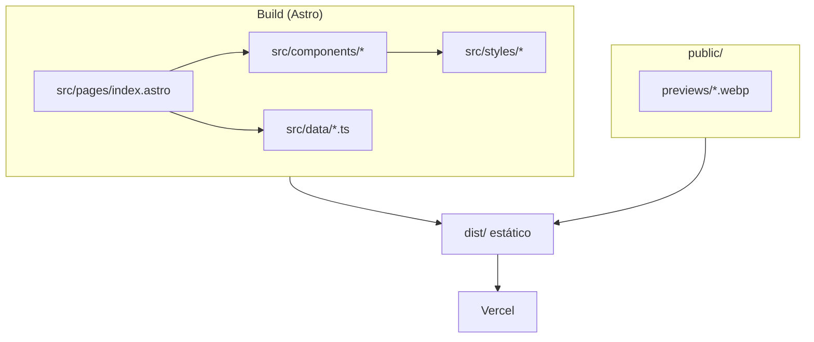

# Arquitetura MVP — Portfólio Orlando Namba

> Fonte: `pf-arquiteto` (2026-08-10).  
> Inputs: `docs/contexto-projeto.md`, `docs/mvp-produto.md`, `docs/stories-mvp.md`, `docs/direcao-visual-mvp.md`.  
> Escopo: landing single-page PT, sem formulário / sem Backend.

---

## 1. Contexto

O repositório precisa de um site estático (marketing + conversão) com:

- 5 seções: Hero → Sobre → Projetos → Skills → Contato
- Tema **light default** + toggle dark com `localStorage` (não seguir `prefers-color-scheme` na 1ª visita)
- 2 previews WebP 16:10 em `public/previews/`
- Contato = links; deploy Vercel; sem domínio próprio
- Design memorável (direção “Sinal preciso”); conteúdo verdadeiro

---

## 2. Decisão de stack

### Escolha: **Astro 5 + TypeScript + CSS nativo**

| Opção | Veredito | Motivo curto |
|-------|----------|--------------|
| **Astro 5** | **Escolhida** | Site quase 100% estático; JS mínimo; SEO/perf; Vercel first-class |
| Next.js (App Router) | Alternativa | Melhor se houver formulário/API imediato — fora do MVP |
| Vite + React SPA | Não | SEO/first paint piores sem necessidade |
| HTML/CSS puro | Não | DX fraco para iterar tema/dados tipados |

### Por quê Astro

1. MVP = marketing, sem servidor.
2. Bundle pequeno como sinal de marca.
3. Tema + motion com script leve + CSS.
4. Fase 2 com form: Actions/serverless ou reavaliar — sem reescrever agora.
5. Conteúdo tipado em `src/data/*.ts`.



### Dependências previstas

| Pacote | Uso |
|--------|-----|
| `astro` | Framework |
| `typescript` | Tipagem |
| `@astrojs/sitemap` | Opcional |

CSS nativo + custom properties. Sem UI kit. Fontes: Space Grotesk + IBM Plex Sans (UX).

---

## 3. Estrutura de pastas

```text
/
├── public/
│   ├── favicon.svg
│   ├── og-image.webp          # fase polish se necessário
│   └── previews/
│       ├── disparo-inteligente.webp
│       └── nazareno-sbc.webp
├── src/
│   ├── components/
│   │   ├── SiteHeader.astro
│   │   ├── ThemeToggle.astro
│   │   ├── Hero.astro
│   │   ├── Sobre.astro
│   │   ├── Projetos.astro
│   │   ├── ProjectCard.astro
│   │   ├── Skills.astro
│   │   └── Contato.astro
│   ├── data/
│   │   ├── site.ts
│   │   ├── projects.ts
│   │   └── skills.ts
│   ├── layouts/
│   │   └── BaseLayout.astro
│   ├── pages/
│   │   └── index.astro
│   ├── styles/
│   │   ├── tokens.css
│   │   └── global.css
│   └── env.d.ts
├── docs/
├── astro.config.mjs
├── tsconfig.json
├── package.json
└── README.md
```

---

## 4. Tema (light / dark)

| Regra | Comportamento |
|-------|----------------|
| Default | **Light** na 1ª visita |
| Persistência | `localStorage` chave **`portfolio-theme`** |
| Sistema | **Não** usar `prefers-color-scheme` na 1ª pintura |
| DOM | `document.documentElement.setAttribute('data-theme', theme)` |

1. Tokens em `tokens.css` (valores de `docs/direcao-visual-mvp.md`).
2. Script **anti-FOUC inline** no `<head>` de `BaseLayout`.
3. `ThemeToggle` acessível.

---

## 5. Dados

TypeScript em `src/data/` — sem CMS.

- `site.ts` — meta, copy hero/sobre/contato, links
- `projects.ts` — 2 cases (`slug`, `name`, `summary`, `liveUrl`, `previewSrc`, `previewAlt`)
- `skills.ts` — lista agrupada

Sem `repoUrl` nos projetos.

---

## 6. Previews + SEO

| Item | Decisão |
|------|---------|
| Pasta | `public/previews/` |
| Formato | WebP |
| Ratio | **16:10** |

Head: `lang="pt-BR"`, title/description, OG básico, favicon.

---

## 7. Plano Frontend

| Fase | Entrega |
|------|---------|
| F0 | Scaffold Astro + pastas + layout |
| F1 | Tema anti-FOUC + toggle |
| F2 | Dados `site` / `projects` / `skills` |
| F3 | Seções Hero→Contato |
| F4 | Previews capturados + links live |
| F5 | Motion (2–3) + a11y |
| F6 | SEO head |
| F7 | Polish → QA → DevOps |

---

## 8. Notas DevOps

- Vercel, preset Astro, `astro build` → `dist/`
- Sem env vars no MVP; sem domínio próprio
- Preview: branch `dev` + PRs; prod: `main` no go-live

---

## 9. O que NÃO fazer no MVP

Formulário/API/Backend, CMS, i18n, auth, `prefers-color-scheme` na 1ª visita, links de repo nos projetos, domínio próprio, UI kits genéricos, cards no hero, Next “por hábito”.

---

## Changelog

| Data | Autor | Nota |
|------|-------|------|
| 2026-08-10 | pf-arquiteto | Astro 5 + TS; tema; data em TS; Vercel |
| 2026-08-10 | Prompt Engineer | Persistência no repo; chave `portfolio-theme` alinhada às stories |
